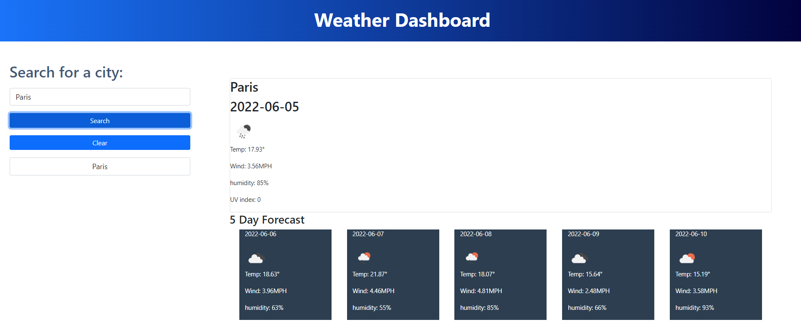

# Weather Dashboard
 
  * [Installation](#installation)
  * [Usage](#usage)
  * [Contributing](#contributing)
  
  ## Installation
  
  *Steps required to install project and how to get the development environment running:*
  
  none
  
  ## Usage 
  
  *Instructions and examples for use:*
  
  just place the name of the city you want to know
  
  ## Credits to
  
  *Special thanks for the following:*
  
  Tec de monterrey
      
    ## Questions?
    
  For any questions, please contact me with the information below:
 
  GitHub: https://github.com/Edwin0204
  Email: edwinsimpsonr@hotmail.com

   ## Mock-Up

   